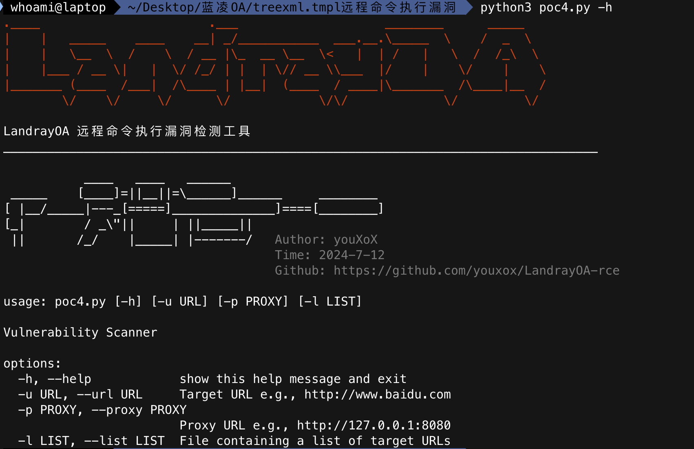
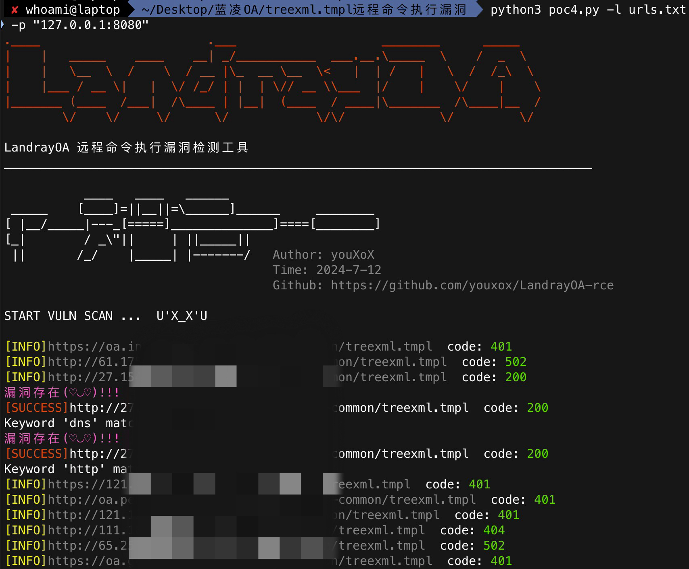

# 声明
  本程序仅供安全学习参考使用,请使用者遵守《中华人民共和国网络安全法》，勿将此脚本用于非授权的测试，脚本开发者不负任何连带法律责任。

# 简介
  目前支持 蓝凌OA treexml.tmpl 远程命令执行漏洞检测

# 帮助

# 示例

# Author✨

<table>
  <tr>
    <td align="center"> <b>youXoX</b> 
  </tr>
